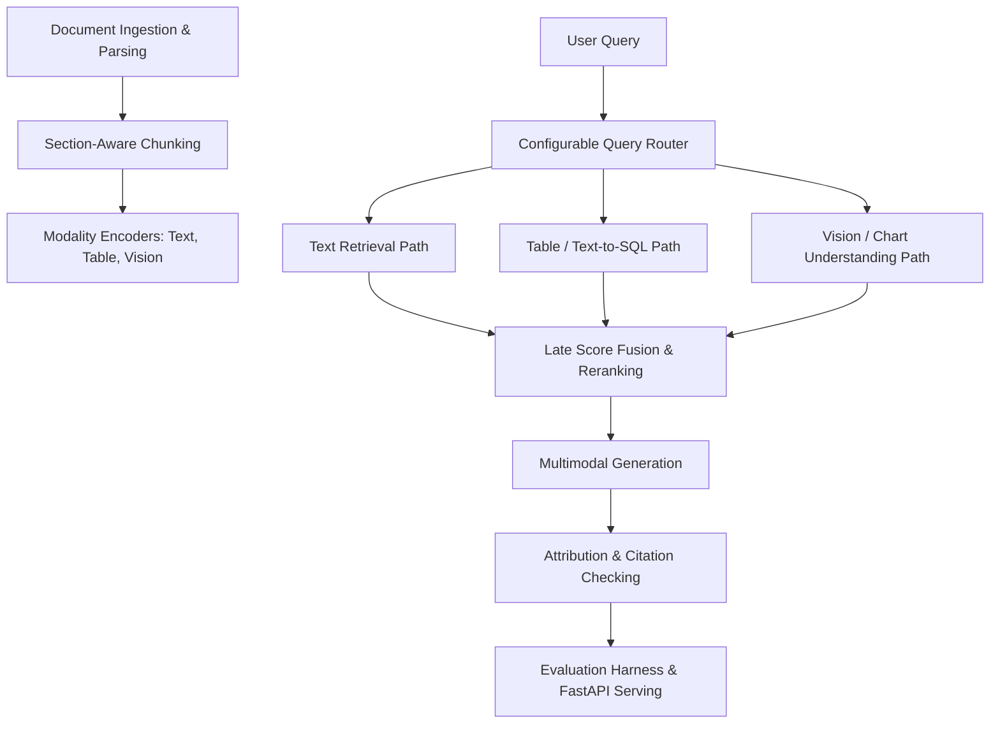

# DocuReason — Tri-Path Multimodal Enterprise RAG

**DocuReason** is an enterprise-grade, multimodal Retrieval-Augmented Generation (RAG) system built to ingest, segment, index, route, retrieve, synthesize grounded answers, and evaluate complex multi-format enterprise documents (PDF, DOCX, PPTX, XLSX, HTML, CSV, and plain text).

---

## 🌟 Key Features

* **Multi-Format Ingestion & Region Segmentation:** Ingests unstructured and semi-structured documents, segmenting content into body text, structured tables, and visual elements (charts, diagrams).
* **Section-Aware Chunking:** Chunks text respecting document section boundaries with configurable token windows and overlap.
* **Tri-Path Retrieval Architecture:**
  * **Text Path:** Hybrid dense vector and sparse keyword search over document body text.
  * **Table / Text-to-SQL Path:** Structured tabular data extraction and SQL query execution over multi-row tables.
  * **Vision / Chart Understanding Path:** Visual feature retrieval and figure/chart understanding.
* **Intelligent Query Routing:** Configurable intent classification routing incoming user queries to the optimal retrieval path(s).
* **Late Score Fusion & Reranking:** Merges relevance scores across text, table, and vision paths using Reciprocal Rank Fusion (RRF).
* **Attribution & Claim Verification:** Grounding verification (NLI attributor) and citation checking to prevent hallucinations.
* **Evaluation Harness:** Automated evaluation metrics, benchmark dataset runners, and ablation testing tools.
* **FastAPI Backend & Interactive Dashboard:** Production-ready API service and a local web dashboard for pipeline visualization.

---

## 🏗️ System Architecture



---

## 📂 Repository Layout

```text
DocuReason/
├── docureason/                 # Core ingestion and pipeline execution wrappers
│   └── pipeline.py
├── src/tripath/                # Modular Tri-Path RAG package
│   ├── ingestion/              # Document loading, region segmentation, & chunking
│   ├── indexing/               # Encoders (text, table, vision) & vector writers
│   ├── router/                 # Query classification & route selection
│   ├── retrieval/              # Tri-path hybrid retrieval (Text, Table/SQL, Vision)
│   ├── fusion/                 # Score normalization & Reciprocal Rank Fusion
│   ├── generation/             # Dynamic prompt building & LLM answer generation
│   ├── attribution/            # NLI grounding & citation validation
│   ├── evaluation/             # Benchmark dataset, harness, & ablation runners
│   └── serving/                # FastAPI backend endpoints & query services
├── scripts/                    # CLI scripts
│   ├── run_phase_pipeline.py   # Runs full end-to-end processing pipeline
│   └── serve_dashboard.py      # Starts the local HTML processing dashboard
├── configs/                    # YAML configuration files
├── samples/                    # Sample documents for testing
├── tests/                      # Pytest unit & integration test suite
└── agent.md                    # Smoke test blueprint and architecture specs
```

---

## 🚀 Quick Start

### 1. Run the Full Pipeline

Process documents in `samples/` and generate index artifacts:

```bash
python scripts/run_phase_pipeline.py
```

The output report will be saved to:
`artifacts/test_run/pipeline_report.json`

### 2. Launch the Local Dashboard

Start the visualization dashboard server:

```bash
python scripts/serve_dashboard.py
```

Then open your browser at:
`http://127.0.0.1:8001`

### 3. Run the FastAPI Server

Launch the production REST API backend:

```bash
uvicorn serving.main:app --reload --port 8000
```

Available API Endpoints:
* `GET /health` — Health check status
* `POST /query` — Run a multimodal RAG query
* `POST /evaluate` — Evaluate retrieval & generation metrics
* `GET /benchmarks` — Retrieve benchmark dataset specs

### 4. Run Test Suite

Run pytest across all modules:

```bash
python -m pytest -q
```

---

## 📄 License

This project is licensed under the MIT License - see the [LICENSE](LICENSE) file for details.

