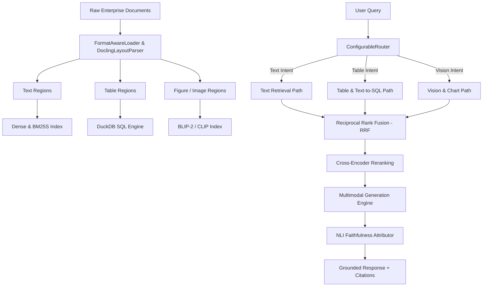

# DocuReason v1.0.0 — Enterprise-Grade Tri-Path Multimodal RAG Framework

[](https://github.com/arpitkumar2004/DocuReason)
[](https://www.python.org/)
[](LICENSE)
[]()

**DocuReason** is an enterprise-grade, multimodal Retrieval-Augmented Generation (RAG) framework for Python. Built for complex multi-format enterprise document processing, DocuReason ingests, parses, segments, indexes, routes, retrieves, synthesizes grounded answers, and evaluates document corpora across text, tabular, and visual modalities.

---

## 📋 Table of Contents

1. [Overview](#-overview)
2. [Key Features](#-key-features)
3. [Architecture](#-architecture)
4. [Installation](#-installation)
5. [Quick Start](#-quick-start)
   - [Python API](#1-python-api)
   - [CLI Commands](#2-cli-commands)
   - [FastAPI REST Server](#3-fastapi-rest-server)
   - [Interactive Web Dashboard](#4-interactive-web-dashboard)
6. [Standard Library API Reference](#-standard-library-api-reference)
   - [`docureason.pipeline`](#docureasonpipeline)
   - [`tripath.ingestion`](#tripathingestion)
   - [`tripath.indexing`](#tripathindexing)
   - [`tripath.router`](#tripathrouter)
   - [`tripath.retrieval`](#tripathretrieval)
   - [`tripath.fusion`](#tripathfusion)
   - [`tripath.generation`](#tripathgeneration)
   - [`tripath.attribution`](#tripathattribution)
   - [`tripath.evaluation`](#tripathevaluation)
   - [`tripath.serving`](#tripathserving)
7. [REST API Endpoint Reference](#-rest-api-endpoint-reference)
8. [Configuration Guide](#-configuration-guide)
9. [Running Tests & Validation](#-running-tests--validation)
10. [License](#-license)

---

## 🌐 Overview

Enterprise document collections contain a mix of prose, multi-row financial tables, and embedded diagrams or charts. Standard RAG systems treat all content as plain text, leading to severe accuracy degradation on tabular data and visual figures.

**DocuReason 1.0.0** addresses this via a **Tri-Path Multimodal RAG Architecture**:
1. **Text Path**: Combines dense vector embeddings (SentenceTransformers / Qdrant) with sparse keyword retrieval (BM25S).
2. **Table / Text-to-SQL Path**: Extracts tabular regions, serializes to Markdown/HTML/JSON schemas, and executes SQL aggregations using DuckDB.
3. **Vision / Chart Path**: Uses visual feature extractors (ColPali / CLIP) and BLIP-2 figure captioning for visual chart understanding.

Incoming queries are dynamically routed using soft probability scoring, retrieved hits are merged via Reciprocal Rank Fusion (RRF) and Cross-Encoder reranking, and outputs undergo NLI-based attribution to guarantee zero hallucinations.

---

## ✨ Key Features

* **Multi-Format Document Parsing**: Native support for `.pdf`, `.docx`, `.pptx`, `.xlsx`, `.html`, `.csv`, `.md`, and `.txt`.
* **Deep Layout Segmentation**: Uses TableFormer + DocLayNet (via Docling) to separate text blocks, data tables, and figures.
* **EasyOCR Fallback**: Automatic scan detection and optical character recognition for scanned PDFs or image-only document pages.
* **Figure Captioning & Embeddings**: Visual caption generation using BLIP-2 and feature encoding via CLIP / ColPali engines.
* **Intent-Based Query Routing**: Keyword match density scaling with sigmoid normalization for text, table, and vision paths.
* **Reciprocal Rank Fusion & Reranking**: Late score fusion combining multi-path rankings with parent-child chunk expansion.
* **Attribution & Claim Verification**: Sentence-level NLI entailment checking to verify citations and ground LLM answers.
* **Production Evaluation Harness**: Built-in benchmark runners measuring Recall@K, nDCG@K, table accuracy, and ablation metrics.
* **FastAPI Serving & Visualization Dashboard**: Production REST API endpoints and an interactive local HTML pipeline dashboard.

---

## 🏗️ Architecture



---

## 📦 Installation

### Prerequisites
* Python >= 3.10
* PyTorch >= 2.0.0
* Recommended: CUDA-capable GPU (for accelerated vision/SLM inference)

### Install from Source

Clone the repository and install in editable mode:

```bash
git clone https://github.com/arpitkumar2004/DocuReason.git
cd DocuReason
pip install -e .
```

Verify the installation:

```python
import docureason
print(docureason.__version__)  # Output: 1.0.0
```

---

## 🚀 Quick Start

### 1. Python API

#### Ingestion and Indexing Pipeline
```python
from docureason import Phase1Pipeline

# Initialize the pipeline
pipeline = Phase1Pipeline(
    input_dir="samples",
    output_dir="artifacts/my_index"
)

# Run document parsing, segmentation, and index generation
report = pipeline.run()
print(f"Processed {report['document_count']} documents and {report['chunk_count']} chunks.")
```

#### Query Execution & Answer Generation
```python
from src.tripath.serving.query_service import QueryService

# Initialize the end-to-end query service
service = QueryService(
    input_dir="samples",
    output_dir="artifacts/my_index"
)

# Execute a multimodal query
response = service.query("What was the Q3 revenue growth shown in the comparison table?")

print("Answer:", response["answer"])
print("Routing:", response["route"])
print("Top Document:", response["results"][0]["document_id"])
```

### 2. CLI Commands

DocuReason provides built-in command-line interfaces:

```bash
# Execute the full end-to-end processing pipeline
python -m docureason --input-dir samples --output-dir artifacts/test_run

# Or run via script
python scripts/run_phase_pipeline.py
```

### 3. FastAPI REST Server

Launch the production REST API server:

```bash
uvicorn src.tripath.serving.main:app --host 0.0.0.0 --port 8000 --reload
```

### 4. Interactive Web Dashboard

Launch the local HTML dashboard to inspect pipeline metrics and indices visually:

```bash
python scripts/serve_dashboard.py
```
Open browser at: `http://127.0.0.1:8001`

---

## 📚 Standard Library API Reference

Below is the complete API reference for all core modules in the `docureason` and `tripath` packages.

---

### `docureason.pipeline`

#### `class docureason.pipeline.Phase1Pipeline(input_dir: str | Path, output_dir: str | Path)`
The primary high-level ingestion pipeline orchestrator. Standardizes document loading, layout parsing, table serialization, OCR fallback, figure captioning, and vector index construction.

* **Parameters:**
  * `input_dir` (*str | Path*): Path to input document directory containing files to ingest.
  * `output_dir` (*str | Path*): Path to output directory where index artifacts and reports will be saved.

##### `run() -> Dict[str, object]`
Executes the full document processing pipeline over `input_dir`.

* **Returns:** *Dict[str, object]* — Summary metadata dictionary containing:
  * `"status"` (*str*): Execution status (`"completed"`).
  * `"document_count"` (*int*): Total number of ingested documents.
  * `"chunk_count"` (*int*): Total number of generated chunks across all modalities.
  * `"dense_vectors"` (*int*): Number of dense vector embeddings indexed.
  * `"sparse_terms"` (*int*): Number of unique BM25 terms indexed.

---

### `tripath.ingestion`

Document ingestion, multi-format loading, region layout parsing, OCR fallback, table serialization, and figure captioning.

#### `class src.tripath.ingestion.format_loader.FormatAwareLoader()`
Extracts raw text and deep layout structures from multi-format files (`.pdf`, `.docx`, `.pptx`, `.xlsx`, `.html`, `.csv`, `.md`, `.txt`).

##### `load(path: str | Path) -> Dict[str, object]`
Fast-path text extraction for a file. Returns file metadata and raw text.

##### `load_deep(path: str | Path) -> Optional[Any]`
Deep-path conversion using Docling. Returns a raw layout `ConversionResult` object for PDFs/DOCX/PPTX/XLSX.

##### `iter_supported_files(dir_path: str | Path) -> Iterator[Path]`
Yields supported file paths within `dir_path`.

#### `class src.tripath.ingestion.docling_layout_parser.DoclingLayoutParser(page_batch_size: int = 1, do_ocr: bool = False)`
Extracts structured `Region` objects (text, tables, figures, code blocks) from Docling layout parse trees.

##### `parse(docling_result: Any) -> List[Region]`
Converts raw layout parse output into a sequence of typed document `Region` objects.

#### `class src.tripath.ingestion.table_serializer.TableSerializer()`
Serializes structured document tables into multiple formats optimized for downstream LLM generation and SQL execution.

##### `serialize(table_item: Any) -> Dict[str, Any]`
Converts a table region into a dictionary containing:
* `"markdown"` (*str*): GFM Markdown representation of the table.
* `"html"` (*str*): Clean HTML `<table>` representation.
* `"json"` (*dict*): Structured `{"columns": [...], "rows": [[...]]}` format for DuckDB.

#### `class src.tripath.ingestion.figure_captioner.FigureCaptioner(use_blip2: bool = True, use_clip: bool = True)`
Generates textual captions for document figures/charts using BLIP-2 and extracts visual feature vectors using CLIP.

##### `caption(image: Any) -> str`
Generates a descriptive natural language caption for an image or chart.

##### `embed(image: Any) -> List[float]`
Extracts normalized CLIP visual feature embedding vector.

#### `class src.tripath.ingestion.ocr_fallback.OCRFallback(languages: List[str] = ["en"])`
Applies EasyOCR to scanned image-only document pages when character count checks fall below density threshold.

##### `process_page(image_input: Any) -> str`
Performs OCR text extraction on the provided image input.

#### `class src.tripath.ingestion.identity.IdentityManager()`
Generates deterministic, unique hashes for document IDs and region IDs.

##### `build_document_id(path: Path) -> str`
Creates a SHA-256 derived identifier based on file contents and path.

##### `build_region_id(doc_id: str, index: int) -> str`
Creates a deterministic region identifier string.

---

### `tripath.indexing`

Dense vector, sparse BM25S, and artifact storage writers.

#### `class src.tripath.indexing.dense_index.DenseIndexBuilder(output_dir: str | Path)`
Builds dense vector index artifacts using SentenceTransformers embeddings.

##### `build_index(chunks: List[Dict[str, Any]]) -> Dict[str, Any]`
Generates embeddings for all chunks and persists vector arrays to `output_dir`.

##### `query(vector: List[float], k: int = 5) -> List[Dict[str, Any]]`
Performs cosine similarity search over indexed dense vectors.

#### `class src.tripath.indexing.sparse_index.BM25SIndexBuilder(output_dir: str | Path)`
Builds lightweight sparse keyword indices using BM25S token scoring.

##### `build_index(chunks: List[Dict[str, Any]]) -> Dict[str, Any]`
Tokenizes chunks and constructs inverted BM25 index persisted to disk.

##### `query(text: str, k: int = 5) -> List[Dict[str, Any]]`
Performs BM25 keyword matching and score computation.

#### `class src.tripath.indexing.artifact_writer.ArtifactWriter(output_dir: str | Path)`
Serializes document corpus definitions, chunk manifests, and pipeline reports to JSON files.

---

### `tripath.router`

Query intent classification, soft probability scoring, and route decision engines.

#### `class src.tripath.router.configurable_router.ConfigurableRouter(config: Optional[Dict[str, List[str]]] = None, threshold: float = 0.35)`
Intent router evaluating query keyword density against configured modality topic dictionaries (`text`, `table`, `vision`).

##### `route(query: str) -> Dict[str, bool]`
Returns boolean activation flags for each modality based on `threshold`.

##### `route_probabilities(query: str) -> Dict[str, float]`
Computes soft probability scores (0.0 to 1.0) using sigmoid scaling over keyword matches.

##### `get_route_weights(query: str) -> Dict[str, float]`
Returns normalized fusion weights across modalities summing to 1.0 for Reciprocal Rank Fusion.

---

### `tripath.retrieval`

Tri-path retrieval implementations (Text, Table/SQL, Vision), chart understanding, and rankers.

#### `class src.tripath.retrieval.hybrid_retriever.HybridRetriever()`
Full multi-path retriever integrating routing, sub-path retrieval, Reciprocal Rank Fusion (RRF), parent-child chunk expansion, and cross-encoder reranking.

##### `retrieve(query: str, documents: List[Document]) -> List[Dict[str, Any]]`
Executes multi-path search over `documents` and returns reranked relevance candidates.

#### `class src.tripath.retrieval.table_sql.TableSQLRetriever()`
Converts table JSON schemas into temporary DuckDB tables and executes text-to-SQL queries to retrieve structured answer sets.

##### `retrieve(query: str, documents: List[Document]) -> List[Dict[str, Any]]`
Translates query into SQL statement, executes against in-memory DuckDB, and formats tabular results.

#### `class src.tripath.retrieval.ranker.Ranker()`
Cross-encoder relevance scoring and reranking module.

##### `rank(query: str, candidates: List[Dict[str, Any]]) -> List[Dict[str, Any]]`
Re-scores candidate chunks against `query` using cross-encoder attention and returns sorted top hits.

---

### `tripath.fusion`

Late score fusion and normalization algorithms.

#### `class src.tripath.fusion.fuse.Fuser(rrf_k: int = 60)`
Combines multi-list candidate rankings into a unified score distribution.

##### `fuse(batches: List[List[Dict[str, Any]]], router_weights: Optional[Dict[str, float]] = None) -> List[Dict[str, Any]]`
Applies weighted Reciprocal Rank Fusion (RRF) across `batches` of retrieved candidates:

$$\text{RRF\_Score}(d) = \sum_{m \in \text{Paths}} w_m \cdot \frac{1}{k + \text{rank}_m(d)}$$

---

### `tripath.generation`

Grounded response generation module supporting local SLMs, Cloud LLMs, and fallback synthesizers.

#### `class src.tripath.generation.generate.GenerationModule(backend: str = "auto", model_name_or_path: str = "deepseek-ai/DeepSeek-R1-Distill-Qwen-1.5B")`

##### `generate(query: str, evidence: List[Dict[str, Any]], sql_results: Optional[Dict[str, Any]] = None) -> Dict[str, Any]`
Generates a grounded natural language response backed by retrieved evidence chunks and tabular SQL outputs.

* **Returns:** *Dict[str, Any]* containing:
  * `"answer"` (*str*): Synthesized response string.
  * `"citations"` (*List[str]*): List of document chunk IDs cited in answer.
  * `"reasoning"` (*Optional[str]*): DeepSeek reasoning chain if available.

---

### `tripath.attribution`

Claim attribution and NLI faithfulness engine.

#### `class src.tripath.attribution.nli_attributor.NLIFaithfulnessAttributor()`

##### `attribute(answer: str, evidence: List[Dict[str, Any]]) -> Dict[str, Any]`
Deconstructs `answer` into discrete sentence claims and computes entailment precision against `evidence`.

* **Returns:** *Dict[str, Any]* containing:
  * `"claims"` (*List[dict]*): Sentence-level support breakdown.
  * `"attribution_precision"` (*float*): Fraction of claims supported by evidence (0.0 to 1.0).
  * `"status"` (*str*): `"verified"` if precision >= 0.5, else `"needs_review"`.

---

### `tripath.evaluation`

Metrics collection, benchmark dataset runners, and ablation studies.

#### `class src.tripath.evaluation.eval_harness.EvaluationHarness(output_dir: str | Path)`

##### `evaluate(query: str, results: List[dict], relevant_ids: Optional[List[str]] = None) -> Dict[str, float]`
Computes retrieval performance metrics including Recall@5 and nDCG@5.

##### `save(metrics: Dict[str, float], run_name: str = "run") -> Path`
Writes metric evaluation report to JSON file in `output_dir`.

---

### `tripath.serving`

Synchronous and asynchronous query services for API integration.

#### `class src.tripath.serving.query_service.QueryService(input_dir: str | Path, output_dir: str | Path)`

##### `query(text: str) -> Dict[str, object]`
Runs end-to-end pipeline search, fusion, reranking, vector embedding, and generation for `text`.

---

## 🔌 REST API Endpoint Reference

When running `uvicorn src.tripath.serving.main:app --port 8000`, the server exposes the following OpenAPI endpoints:

| Method | Endpoint | Description | Request Body / Parameters |
| :--- | :--- | :--- | :--- |
| `GET` | `/health` | Server readiness check | None |
| `GET` | `/api/report` | Returns last pipeline execution report | None |
| `POST` | `/query` | Executes multimodal query and returns answer | `{"query": "string", "input_dir": "samples"}` |
| `POST` | `/api/ingest` | Triggers document ingestion pipeline | `{"input_dir": "samples", "output_dir": "artifacts/run"}` |
| `POST` | `/api/evaluate` | Evaluates retrieval metrics for query | `{"query": "string", "relevant_ids": ["doc_1"]}` |
| `GET` | `/api/benchmarks`| Returns loaded benchmark dataset spec | None |

---

## ⚙️ Configuration Guide

Pipeline parameters can be customized via `configs/pipeline_config.yaml`:

```yaml
version: "1.0.0"

ingestion:
  page_batch_size: 1
  do_ocr: false
  ocr_languages: ["en"]

chunking:
  max_tokens: 512
  overlap: 64

router:
  threshold: 0.35
  keywords:
    text: ["revenue", "growth", "statement", "report"]
    table: ["table", "quarter", "sum", "total", "average"]
    vision: ["chart", "figure", "graph", "plot", "diagram"]

retrieval:
  rrf_k: 60
  top_k: 5
```

---

## 🧪 Running Tests & Validation

DocuReason maintains a comprehensive test suite covering all modules:

```bash
# Run pytest across all test modules
python -m pytest -q
```

Expected Output:
```text
............... [100%]
15 passed in 7.42s
```

---

## 📄 License

This project is licensed under the MIT License - see the [LICENSE](LICENSE) file for details.
