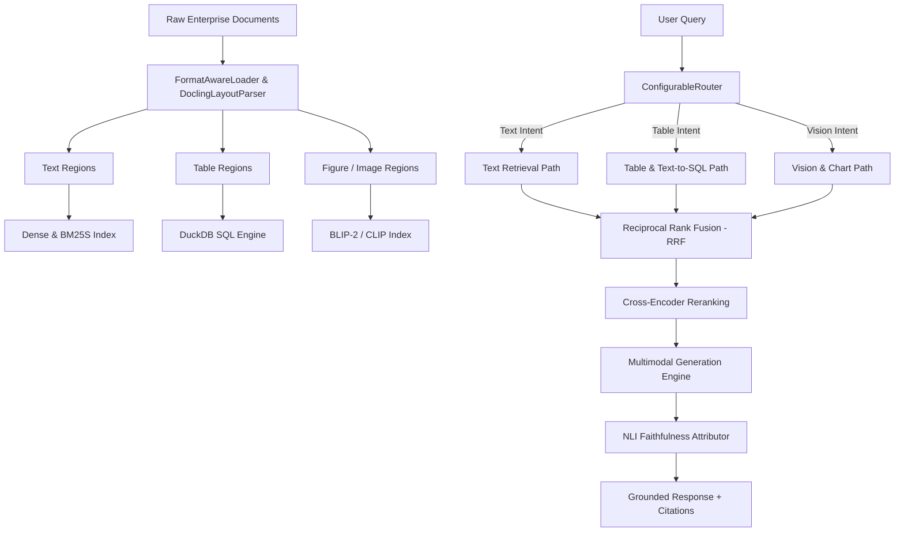

# DocuReason v1.1.0 — Enterprise-Grade Tri-Path Multimodal RAG Framework

[](https://pypi.org/project/docureason-framework/)
[](https://www.python.org/)
[](LICENSE)
[]()
[](https://github.com/psf/black)

**DocuReason** (`docureason-framework`) is an enterprise-grade, multimodal Retrieval-Augmented Generation (RAG) framework for Python. Built for multi-format enterprise document processing, DocuReason ingests, parses, segments, indexes, routes, retrieves, synthesizes grounded answers, and evaluates document corpora across text, tabular, and visual modalities.

---

## Table of Contents

1. [Overview](#overview)
2. [Key Features](#key-features)
3. [Architecture](#architecture)
4. [Installation](#installation)
   - [PyPI Installation](#pypi-installation)
   - [Install from Source](#install-from-source)
   - [Kaggle & Offline Notebook Installation](#kaggle--offline-notebook-installation)
5. [Quick Start](#quick-start)
   - [Python API](#1-python-api)
   - [CLI Commands](#2-cli-commands)
   - [FastAPI REST Server](#3-fastapi-rest-server)
   - [Interactive Web Dashboard](#4-interactive-web-dashboard)
6. [Underlying Open-Source Libraries & Documentation Links](#underlying-open-source-libraries--documentation-links)
7. [Standard Library API Reference](#standard-library-api-reference)
   - [`docureason.pipeline`](#docureasonpipeline)
   - [`docureason.ingestion`](#docureasoningestion)
   - [`docureason.serving`](#docureasonserving)
   - [`src.tripath.retrieval`](#srctripathretrieval)
   - [`src.tripath.attribution`](#srctripathattribution)
   - [`src.tripath.evaluation`](#srctripathevaluation)
8. [Fine-Tuning Dataset Exporter](#fine-tuning-dataset-exporter)
9. [REST API Endpoint Reference](#rest-api-endpoint-reference)
10. [Configuration Guide](#configuration-guide)
11. [Running Tests & Validation](#running-tests--validation)
12. [License](#license)

---

## Overview

Enterprise document collections contain a mix of prose, multi-row financial tables, and embedded diagrams or charts. Standard RAG systems treat all content as plain text, leading to severe accuracy degradation on tabular data and visual figures.

**DocuReason 1.1.0** addresses this via a **Tri-Path Multimodal RAG Architecture**:
1. **Text Path**: Combines dense vector embeddings ([SentenceTransformers](https://www.sbert.net/) / [Qdrant](https://qdrant.tech/)) with sparse keyword retrieval ([BM25S](https://github.com/xhluca/bm25s)).
2. **Table / Text-to-SQL Path**: Extracts tabular regions, serializes to Markdown/HTML/JSON schemas, and executes SQL aggregations using [DuckDB](https://duckdb.org/).
3. **Vision / Chart Path**: Uses visual feature extractors ([ColPali](https://github.com/illuin-tech/colpali) / [CLIP](https://huggingface.co/docs/transformers/model_doc/clip)) and [BLIP-2](https://huggingface.co/docs/transformers/model_doc/blip-2) figure captioning for visual chart understanding.

Incoming queries are dynamically routed using soft probability scoring, retrieved hits are merged via Reciprocal Rank Fusion (RRF) and Cross-Encoder reranking, and outputs undergo NLI-based attribution to guarantee zero hallucinations.

---

## Key Features

* **Multi-Format Document Parsing**: Native support for `.pdf`, `.docx`, `.pptx`, `.xlsx`, `.html`, `.csv`, `.md`, and `.txt`.
* **Deep Layout Segmentation**: Uses TableFormer + DocLayNet via [Docling](https://ds4sd.github.io/docling/) to separate text blocks, data tables, and figures.
* **EasyOCR Fallback**: Automatic scan detection and optical character recognition for scanned PDFs or image-only document pages using [EasyOCR](https://github.com/JaidedAI/EasyOCR).
* **Figure Captioning & Embeddings**: Visual caption generation using [BLIP-2](https://huggingface.co/docs/transformers/model_doc/blip-2) and feature encoding via CLIP / [ColPali](https://github.com/illuin-tech/colpali) engines.
* **Intent-Based Query Routing**: Keyword match density scaling with sigmoid normalization for text, table, and vision paths.
* **Reciprocal Rank Fusion & Reranking**: Late score fusion combining multi-path rankings with parent-child chunk expansion.
* **Attribution & Claim Verification**: Sentence-level NLI entailment checking via [DeBERTa-v3](https://huggingface.co/cross-encoder/nli-deberta-v3-small) to verify citations and ground LLM answers.
* **Production Evaluation Harness**: Built-in benchmark runners measuring Recall@K, nDCG@K, table TEDS accuracy, and ablation metrics.
* **Fine-Tuning Exporter**: Export processed interaction traces directly into HuggingFace dataset formats for training custom RAG models.
* **FastAPI Serving & Visualization Dashboard**: Production REST API endpoints and an interactive local HTML pipeline dashboard.

---

## Architecture



---

## Installation

### PyPI Installation

Install the official published package from PyPI:

```bash
pip install docureason-framework
```

### Install from Source

Clone the repository and install in editable mode:

```bash
git clone https://github.com/arpitkumar2004/DocuReason.git
cd DocuReason
pip install -e .
```

Verify installation:

```python
import docureason
print(docureason.__version__)  # Output: 1.0.1
```

### Kaggle & Offline Notebook Installation

To install in Kaggle or offline environments without internet access, upload the `.whl` package file as a Kaggle Dataset and install:

```python
!pip install /kaggle/input/your-dataset-name/docureason_framework-1.0.1-py3-none-any.whl
```

Or install directly from GitHub:

```python
!pip install git+https://github.com/arpitkumar2004/DocuReason.git
```

---

## Quick Start

### 1. Python API

#### High-Level Ingestion and Indexing Pipeline
```python
from docureason import DocuReasonPipeline

# Initialize the offline ingestion pipeline
pipeline = DocuReasonPipeline(
    input_dir="samples",
    output_dir="artifacts/my_index"
)

# Run document parsing, layout segmentation, table serialization, and index generation
report = pipeline.run()
print(f"Processed {report['document_count']} documents and {report['chunk_count']} chunks.")
```

#### Online Query Execution & Answer Serving
```python
from docureason.serving import QueryService

# Initialize the end-to-end serving query engine
service = QueryService(
    input_dir="samples",
    output_dir="artifacts/my_index"
)

# Execute a multimodal query
response = service.query("What was the Q3 revenue growth shown in the comparison table?")

print("Answer:", response["answer"])
print("Routing:", response["route"])
print("Top Document:", response["results"][0]["document_id"])
```

### 2. CLI Commands

DocuReason provides built-in command-line interfaces:

```bash
# Execute the full end-to-end processing pipeline
python -m docureason --input-dir samples --output-dir artifacts/test_run

# Or run via script
python scripts/run_pipeline.py
```

### 3. FastAPI REST Server

Launch the production REST API server:

```bash
uvicorn src.tripath.serving.main:app --host 0.0.0.0 --port 8000 --reload
```

### 4. Interactive Web Dashboard

Launch the local HTML dashboard to inspect pipeline metrics and indices visually:

```bash
python scripts/serve_dashboard.py
```
Open browser at: `http://127.0.0.1:8001`

---

## Underlying Open-Source Libraries & Documentation Links

DocuReason builds upon industry-standard machine learning and data processing libraries. Below is the mapping of components to their official documentation:

| Component / Engine | Purpose in DocuReason | Official Library Documentation | Primary Function / Class Used |
| :--- | :--- | :--- | :--- |
| **Docling** | Deep document layout parsing & TableFormer | [Docling Documentation](https://ds4sd.github.io/docling/) | [`DocumentConverter`](https://ds4sd.github.io/docling/concepts/architecture/) |
| **DuckDB** | In-memory Text-to-SQL tabular execution | [DuckDB Python API](https://duckdb.org/docs/api/python/overview.html) | [`duckdb.connect()`](https://duckdb.org/docs/api/python/overview.html#querying) |
| **Qdrant** | High-performance vector index storage | [Qdrant Documentation](https://qdrant.tech/documentation/) | [`QdrantClient`](https://qdrant.tech/documentation/concepts/collections/) |
| **BM25S** | Fast sparse lexical search engine | [BM25S GitHub](https://github.com/xhluca/bm25s) | [`bm25s.BM25`](https://github.com/xhluca/bm25s#quick-start) |
| **SentenceTransformers** | Dense vector text embeddings | [SentenceTransformers Docs](https://www.sbert.net/) | [`SentenceTransformer.encode()`](https://www.sbert.net/docs/package_reference/SentenceTransformer.html) |
| **Hugging Face Transformers** | Cross-Encoder reranking & NLI entailment | [Transformers Documentation](https://huggingface.co/docs/transformers/) | [`AutoModelForSequenceClassification`](https://huggingface.co/docs/transformers/main_classes/model) |
| **BLIP-2** | Image & chart visual captioning | [BLIP-2 Model Docs](https://huggingface.co/docs/transformers/model_doc/blip-2) | [`Blip2ForConditionalGeneration`](https://huggingface.co/docs/transformers/model_doc/blip-2) |
| **ColPali & CLIP** | Multi-modal visual feature extraction | [ColPali Repository](https://github.com/illuin-tech/colpali) | [`ColPaliForRetrieval`](https://github.com/illuin-tech/colpali) |
| **EasyOCR** | Scanned document OCR fallback engine | [EasyOCR Documentation](https://github.com/JaidedAI/EasyOCR) | [`easyocr.Reader`](https://github.com/JaidedAI/EasyOCR#usage) |
| **FastAPI** | Asynchronous HTTP REST microservice | [FastAPI Documentation](https://fastapi.tiangolo.com/) | [`FastAPI()`](https://fastapi.tiangolo.com/tutorial/first-steps/) |
| **MLflow** | Metrics logging & experiment tracking | [MLflow Documentation](https://mlflow.org/docs/latest/index.html) | [`mlflow.log_metrics()`](https://mlflow.org/docs/latest/python_api/mlflow.html#mlflow.log_metrics) |

---

## Standard Library API Reference

### `docureason.pipeline`

#### `class docureason.pipeline.DocuReasonPipeline(input_dir: str | Path, output_dir: str | Path)`
High-level offline ingestion pipeline orchestrator. Manages layout parsing, table serialization, OCR fallback, figure captioning, and vector index construction.

* **Parameters:**
  * `input_dir` (*str | Path*): Directory path containing raw enterprise documents.
  * `output_dir` (*str | Path*): Directory path where index artifacts are stored.

##### `run() -> Dict[str, Any]`
Executes end-to-end layout segmentation, table processing, vector indexing, and artifact generation.

---

### `docureason.ingestion`

Multi-format document loaders, vision layout parsers, OCR fallback engines, and table serializers.

#### `class docureason.ingestion.DoclingLayoutParser(page_batch_size: int = 1, do_ocr: bool = False)`
Deep layout parsing wrapper utilizing Docling (TableFormer + DocLayNet) to segment text, tables, and figures.

##### `parse(document_path: str | Path) -> List[Region]`
Parses `document_path` and returns typed region bounding boxes and layouts.

#### `class docureason.ingestion.TableSerializer()`
Serializes tabular document regions into GFM Markdown tables, HTML representations, and DuckDB JSON schemas.

##### `serialize(table_region: Region) -> Dict[str, Any]`
Converts `table_region` into linearized Markdown, HTML, and structured schema dictionary `{"columns": [...], "rows": [[...]]}`.

---

### `docureason.serving`

Synchronous and asynchronous query services for production serving.

#### `class docureason.serving.QueryService(input_dir: str | Path, output_dir: str | Path)`
Production query service providing dynamic query routing, multi-path retrieval, RRF fusion, reranking, and generation.

##### `query(text: str) -> Dict[str, Any]`
Executes search, fusion, reranking, and generation for input query `text`.

---

### `src.tripath.retrieval`

Tri-path retrieval engines (Text, Table/SQL, Vision), chart understanding, and cross-encoder rankers.

#### `class src.tripath.retrieval.hybrid_retriever.HybridRetriever()`
Full multi-path retriever integrating routing, sub-path retrieval, Reciprocal Rank Fusion (RRF), parent-child chunk expansion, and cross-encoder reranking.

#### `class src.tripath.retrieval.table_sql.TableSQLRetriever()`
Text-to-SQL retriever executing dynamic queries over DuckDB in-memory database tables.

#### `class src.tripath.retrieval.ranker.Ranker()`
Cross-encoder relevance scoring module.

##### `rank(query: str, candidates: List[Dict[str, Any]]) -> List[Dict[str, Any]]`
Re-scores candidate chunks against `query` using cross-encoder attention and returns sorted top hits.

---

### `src.tripath.attribution`

Claim attribution and NLI faithfulness engine.

#### `class src.tripath.attribution.nli_attributor.NLIFaithfulnessAttributor()`

##### `attribute(answer: str, evidence: List[Dict[str, Any]]) -> Dict[str, Any]`
Deconstructs `answer` into discrete sentence claims and computes entailment precision against `evidence`.

---

### `src.tripath.evaluation`

Evaluation harness, benchmark runners, and ablation studies.

#### `class src.tripath.evaluation.eval_harness.EvaluationHarness(output_dir: str | Path)`

##### `evaluate_single(query: str, results: List[dict], relevant_ids: Optional[List[str]] = None) -> Dict[str, float]`
Computes retrieval performance metrics including Recall@K, nDCG@K, MRR, TEDS, NLI Faithfulness, and SLA target verification.

---

## Fine-Tuning Dataset Exporter

DocuReason provides a built-in `DatasetExporter` module to export processed multi-modal corpora and query logs into SFT (Supervised Fine-Tuning) and DPO (Direct Preference Optimization) dataset formats compatible with HuggingFace `datasets`:

```python
from src.tripath.evaluation.dataset_exporter import DatasetExporter

exporter = DatasetExporter(output_dir="artifacts/my_index")

# Export fine-tuning dataset for SLM training
dataset_path = exporter.export_fine_tuning_dataset(
    output_format="jsonl",
    split="train"
)
print("Exported dataset to:", dataset_path)
```

---

## REST API Endpoint Reference

When running `uvicorn src.tripath.serving.main:app --port 8000`, the server exposes the following OpenAPI endpoints:

| Method | Endpoint | Description | Request Body / Parameters |
| :--- | :--- | :--- | :--- |
| `GET` | `/health` | Server readiness check | None |
| `GET` | `/api/report` | Returns last pipeline execution report | None |
| `POST` | `/query` | Executes multimodal query and returns answer | `{"query": "string", "input_dir": "samples"}` |
| `POST` | `/api/ingest` | Triggers document ingestion pipeline | `{"input_dir": "samples", "output_dir": "artifacts/run"}` |
| `POST` | `/api/evaluate` | Evaluates retrieval metrics for query | `{"query": "string", "relevant_ids": ["doc_1"]}` |
| `GET` | `/api/benchmarks`| Returns loaded benchmark dataset spec | None |

---

## Configuration Guide

Pipeline parameters can be customized via `configs/pipeline_config.yaml`:

```yaml
version: "1.0.1"

ingestion:
  page_batch_size: 1
  do_ocr: false
  ocr_languages: ["en"]

chunking:
  max_tokens: 512
  overlap: 64

router:
  threshold: 0.35
  keywords:
    text: ["revenue", "growth", "statement", "report"]
    table: ["table", "quarter", "sum", "total", "average"]
    vision: ["chart", "figure", "graph", "plot", "diagram"]

retrieval:
  rrf_k: 60
  top_k: 5
```

---

## Running Tests & Validation

DocuReason maintains a comprehensive test suite covering all modules:

```bash
# Run pytest across all test modules
python -m pytest -q
```

---

## License

This project is licensed under the MIT License - see the [LICENSE](LICENSE) file for details.
